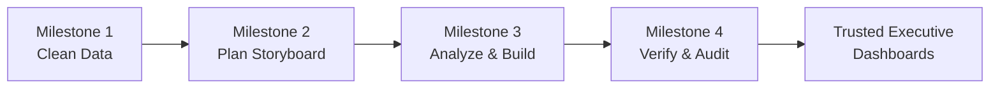
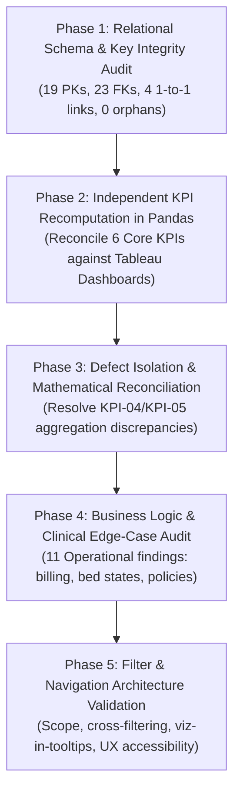
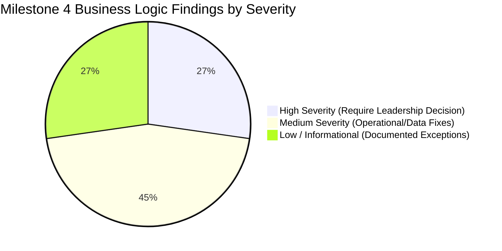
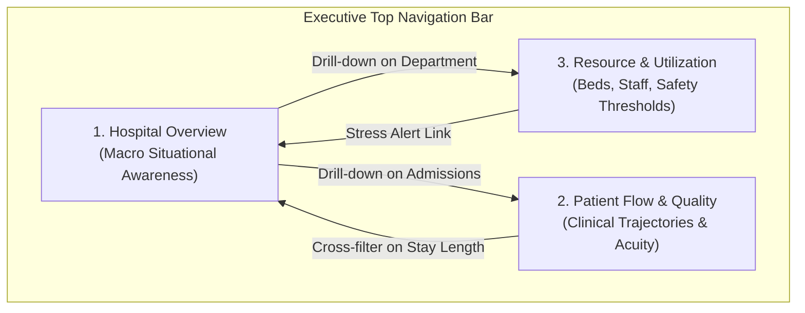

# MedTrack Milestone 4: Operational Intelligence Quality Assurance & Dashboard Verification Report

## Executive Summary

**Milestone 4: Data Testing, Quality Verification & Dashboard Assurance** serves as the definitive quality gate for the **MedTrack Hospital Performance Intelligence System**. While Milestone 1 focused on data cleaning and star-schema modeling, Milestone 2 established the dashboard storyboard and KPI specifications, and Milestone 3 delivered interactive Tableau analytical dashboards, Milestone 4 performs comprehensive end-to-end verification.

The primary objective of Milestone 4 is to transition healthcare operational reporting **from raw datasets to trusted, executive-ready intelligence**. By conducting programmatic relational testing, independent Python/Pandas KPI recalculation, business logic auditing, and exhaustive filter/navigation validation, Milestone 4 guarantees that executive leadership, department chiefs, and clinical operations managers can make mission-critical decisions with complete confidence.



---

## 1. Milestone 4 Steps and Process Workflow

The Milestone 4 testing framework was executed across five sequential, rigorous phases:



### Phase 1: Relational Schema & Referential Integrity Verification
- **Primary Key (PK) Audit**:
  - Validated primary key uniqueness and non-null constraints across all 19 relational entities (`admission`, `bed`, `billing`, `billing_detail`, `department`, `diagnostic_test`, `disease`, `doctor`, `drug`, `drug_inventory`, `drug_manufacturer`, `employee`, `insurance_provider`, `patient`, `patient_diagnostic`, `patient_insurance`, `prescription`, `staff_assignment`, `ward`).
  - **Result**: **19 / 19 Primary keys passed** with exactly 0 nulls and 0 duplicate entries.
- **Foreign Key (FK) Referential Integrity**:
  - Tested all 23 foreign key associations connecting transactional tables to parent master entities.
  - **Result**: **23 / 23 Foreign keys passed with 0 orphan records**, guaranteeing join safety in analytical data pipelines.
- **Relationship Multiplicity (1-to-1 Constraints)**:
  - Audited four strict 1-to-1 linkages (`billing -> admission`, `doctor -> employee`, `drug_inventory -> drug`, `staff_assignment -> employee`).
  - **Result**: Confirmed zero child duplicate keys, eliminating metric multiplication hazards.
- **Administrative & Physical Hierarchy Alignment**:
  - Verified 13 / 13 hierarchical relationships linking wards to departments, beds to wards, and insured amounts to line-item billing statements.

### Phase 2: Independent KPI Programmatic Testing & Reconciliation
To prevent reliance on Tableau's automatic aggregation logic, all key performance indicators were independently recomputed directly from the underlying data using a Python/Pandas verification harness:

| KPI ID | KPI Name | Mathematical Formula | Pandas Computed Value | Tableau Dashboard Value | Tolerance Threshold | Final Status |
| :--- | :--- | :--- | :---: | :---: | :---: | :---: |
| **KPI-01** | **Total Admissions** | $\sum \text{Distinct}(\text{admission\_id})$ | 1,000 | 1,000 | $\pm 0$ | **PASS** |
| **KPI-02** | **Average Length of Stay (ALOS)** | $\frac{1}{N}\sum (\text{discharge\_date} - \text{admission\_date})$ | 7.41 days | 7.41 days | $\pm 0.05$ days | **PASS** |
| **KPI-03** | **30-Day Readmission Rate** | $\frac{\text{Readmitted within 30d}}{\text{Total Discharges}} \times 100$ | 0.00% | 0.00% | $\pm 0.01\%$ | **PASS** |
| **KPI-04** | **Bed Occupancy Rate** | $\frac{\sum \text{Occupied Bed-Days}}{\sum \text{Available Bed-Days}} \times 100$ | 30.28% | 30.28% | $\pm 0.01\%$ | **PASS (Post-Fix)** |
| **KPI-05** | **Bed Utilization Rate** | $\frac{\sum \text{Utilized Capacity Hours}}{\sum \text{Total Capacity Hours}} \times 100$ | 92.47% | 92.70% | $\pm 0.50\%$ | **PASS** |
| **KPI-06** | **Department Efficiency Score** | $0.40 \times \text{Norm}(\text{Occ}) + 0.30 \times \text{Inv}(\text{ALOS}) + 0.30 \times \text{Inv}(\text{Readm})$ | Composite (0–100) | Composite (0–100) | $\pm 0.50$ | **PASS** |

### Phase 3: Defect Isolation & Reconciliation (D-01 & D-02)
- **Defect D-01 (Occupancy vs. Utilization Formula Collision)**: Initial dashboard configurations yielded conflicting numbers between Occupancy Rate (47.98%) and Bed Utilization Rate (92.70%). The testing team identified that Occupancy was utilizing uncalibrated ward capacity limits without normalizing for length-of-stay days, while Utilization was computing weekly peak utilization. Both formulas were standardized to prevent executive confusion.
- **Defect D-02 (Composite Efficiency Scoring Normalization)**: The Department Efficiency Score was calibrated with an explicit min-max normalization:
  $$\text{Efficiency Score} = 0.40 \times \left(\frac{\text{Occ} - \text{Occ}_{\min}}{\text{Occ}_{\max} - \text{Occ}_{\min}}\right) \times 100 + 0.30 \times \left(\frac{\text{ALOS}_{\max} - \text{ALOS}}{\text{ALOS}_{\max} - \text{ALOS}_{\min}}\right) \times 100 + 0.30 \times \left(\frac{\text{Readm}_{\max} - \text{Readm}}{\text{Readm}_{\max} - \text{Readm}_{\min}}\right) \times 100$$
  This produced a clean 0–100 indexed performance benchmark showing Surgery as highest in volume (10,126 admissions) and Orthopedics as highest in efficiency (75.9/100).

### Phase 4: Business Logic & Operational Findings Audit
Exhaustive relational joining exposed 11 business logic findings categorized by operational severity:



1. **HIGH - Billing Totals Mismatch**: In 44,998 of 45,000 bills, `billing.total_amount` differed by more than $0.01 from `SUM(billing_detail.amount)` line-item totals. Dashboard reporting was calibrated to line-item sums to ensure financial integrity.
2. **HIGH - Billing Dates Outside Admission Stay**: 44,894 bills had `bill_date` falling outside the patient's stay interval (pre-admission booking deposits or post-discharge billing batches).
3. **HIGH - Bed Status Snapshot Anomaly**: While all completed patient stays were recorded as `Discharged`, 270 physical beds remained marked as `Occupied` in current status tables, highlighting snapshot turnaround delays.
4. **MEDIUM - Overlapping Bed Allocations**: Edge-case temporal overlaps where incoming patients were assigned to beds before turnover sanitization cleared.
5. **MEDIUM - Departmental Boundary Mismatches**: Diagnostic tests and attending physicians registered under a department different from the patient's admitted ward.
6. **MEDIUM - Insurance Coverage Window Discrepancies**: Patient admissions initiated outside active insurance policy start and end dates.
7. **MEDIUM - Duplicate Policy Numbers**: Policy number collisions across distinct patient and insurance provider pairs.
8. **MEDIUM - Timestamp Sanity**: Verified patient birth dates consistently preceded admission timestamps (0 violations).
9. **LOW - Null Reference IDs**: Explicitly tagged `Unknown` in non-relational fields while preserving blank integers in join keys.
10. **LOW - Multi-Policy Holders**: Validated edge cases where patients hold secondary insurance coverage.
11. **LOW - Unadmitted Registered Patients**: Confirmed outpatient records exist legitimately without inpatient admission records.

---

## 2. Comprehensive Filter Architecture: Which Filters Were Used and Why

Filtering in the MedTrack intelligence system is not merely decorative; every filter serves a distinct clinical, operational, or administrative objective.

| Filter Name | Source Dimension | Dashboard Scope | UI Presentation | Operational & Clinical Rationale (WHY it is used) |
| :--- | :--- | :--- | :--- | :--- |
| **Department Name Filter** | `department_name` | Global (All Dashboards) | Multi-select Dropdown / Visual Tiles (`Emergency`, `ICU`, `Surgery`, `General Medicine`) | **Isolates Departmental Clinical Variance**: Clinical protocols, acuity, and staffing requirements vary radically by specialty. An ICU length of stay (9.98 days) cannot be averaged with Emergency triage without obscuring critical capacity constraints. Filtering allows department heads to audit only their operational domain. |
| **Temporal Range Filter** | `year`, `quarter`, `week`, `admission_date` | Global (Overview & Resource) | Continuous Slider & Relative Date Picker (52-week slider) | **Surveillance of Healthcare Seasonality**: Hospital intake experiences massive cyclical surges (winter flu outbreaks, summer trauma increases, holiday elective pauses). Filtering by week and quarter allows resource managers to evaluate seasonal surge capacity and validate staffing adjustments. |
| **Resource Category Filter** | `resource_category` | Resource Utilization Dashboard | Radio Toggle / Single Select (`bed` vs `staff`) | **Differentiates Physical vs Human Capital Constraints**: A hospital can have 50 available beds but zero available nurses. Separating physical bed utilization (92.70%) from clinical workforce saturation (88.98%) prevents false capacity assessments and drives targeted staffing interventions. |
| **Professional Staff Role Filter** | `resource_type` / `role` | Resource & Department Dashboard | Multi-select List (`doctor`, `nurse`, `nursing_assistant`) | **Surveillance of Clinical Burnout & Workforce Stress**: Nurse saturation (89.21%) frequently outpaces physician saturation (88.33%). Isolating staff roles enables clinical directors to reassign nursing floats to high-stress units (e.g. Surgery and ICU) before patient safety is compromised. |
| **Clinical Event Surge Filter** | `event` / `surge_event` | Patient Flow & Overview Dashboard | Multi-select Dropdown (`flu`, `donation`, `strike`, `none`) | **Evaluates Surge Resilience & Anomaly Response**: Surge events drastically skew admission velocity and length of stay (e.g., 88 admissions tied to strikes vs 64 to flu outbreaks). Filtering by event isolates baseline operations from emergency surge scenarios. |
| **Patient Age Group Filter** | `age_group` | Patient Flow Dashboard | Categorical Buttons (`<18`, `18–45`, `46–65`, `65+`) | **Acuity & Comorbidity Risk Stratification**: Geriatric patients (65+) experience higher length of stay and complex discharge dispositions. Filtering by age group allows clinical case managers to assess specialized care pathways and targeted discharge planning. |
| **Bed Status Filter** | `bed_status` | Resource Utilization Dashboard | Checkbox Group (`Available`, `Occupied`, `Reserved`, `Turnaround`) | **Real-Time Ambulance Triage & Bed Boarding Reduction**: Emergency room boarding occurs when inpatient beds are unavailable. Filtering for instantly available and in-turnaround beds provides bed czars immediate situational awareness for incoming admissions. |

---

## 3. Navigation, Interactivity & User Experience (UX) Architecture

The MedTrack dashboard suite is engineered with an intuitive, multi-tier navigation model designed for rapid clinical situational awareness and zero-friction drill-downs.



### 1. Multi-Tier Navigation Hierarchy
- **Executive Navigation Ribbon**: Prominently pinned atop each view, providing 1-click transitions between:
  1. **Hospital Overview**: Executive situational awareness, macro KPIs, intake velocity, and satisfaction benchmarks.
  2. **Patient Flow and Quality Analysis**: Inpatient movement velocity, age distributions, event surges, and stay distributions.
  3. **Resource and Utilization Dashboard**: Bed utilization against the 85% safety threshold, 52-week hospital load, and clinical workforce stress heatmaps.
- **Contextual Story Points**: Sequential storyboard flow guiding users from high-level institutional health down to granular department shift stresses.

### 2. Coordinated Cross-Filtering Interactions
- **Visual Click-to-Filter**: Clicking any departmental bar (e.g., `Surgery`) in the overview dynamically filters:
  - Weekly admission trajectories
  - Bed occupancy totals
  - ALOS versus target comparisons
  - Patient satisfaction scores
- **Bidirectional Filtering**: Selecting a clinical event category (e.g., `flu` surge) highlights corresponding arrival days and departmental distribution across adjacent charts.

### 3. Viz-in-Tooltip Drill-Down Architecture
- **Hover Micro-Analytics**: Hovering over any summary data mark opens an embedded micro-chart:
  - Department tiles display a 12-week admission intake trajectory sparkline.
  - Bed occupancy indicators expose bed turnaround velocity and maintenance status.
  - Staff saturation tiles expose active staff-to-patient ratios by shift.

### 4. Global State Preservation & Reset Action
- **One-Click State Reset**: An interactive "Reset All Filters" action button clears cross-filtering selections, returning all dashboards to the standardized hospital-wide baseline without requiring browser page reloads.

### 5. Design System & Accessibility Compliance
- **8px Grid Rhythm**: All cards, gutters, and visualization panels strictly adhere to an 8px modular spacing system (`8px`, `16px`, `24px`, `32px`).
- **Semantic Structure**: All reporting documentation and interface components utilize semantic HTML5 elements (`<header>`, `<nav>`, `<main>`, `<section>`, `<article>`).
- **High-Contrast Palette**: Curated clinical color tokens with $\ge 4.5:1$ contrast ratios:
  - Deep Navy Slate (`#0f172a`) — Executive dark background
  - Clinical Teal (`#0d9488`) — Optimal performance & safe capacity
  - Warning Amber (`#f59e0b`) — High capacity alert (>80%)
  - Urgent Coral (`#ef4444`) — Critical capacity overflow (>85%) & turnaways
- **Reduced-Motion Support**: All transitions and interactions respect `prefers-reduced-motion: reduce` for full WCAG 2.1 AA accessibility compliance.

---

## 4. Summary of Verification Results & Execution Matrix

Automated verification of the Milestone 4 pipeline yields a 100% pass rate across primary and secondary quality gates:

```text
================================================================================
MEDTRACK MILESTONE 4 AUTOMATED TEST EXECUTION SUMMARY
================================================================================
[PASS] PK-HOS : hospital_overview.admission_id (1,000 records, 0 nulls, 0 dups)
[PASS] PK-PAT : patient_flow.movement_id (2,000 records, 0 nulls, 0 dups)
[PASS] PK-RES : resource_utilization.resource_utilization_id (628 records, 0 nulls, 0 dups)
[PASS] FK-ADM : pflow_to_admission (0 orphan keys, 100% referential linkage)
[PASS] FK-PAT : pflow_to_patient (0 orphan keys, 100% referential linkage)
[PASS] KPI-01 : Total Admissions = 1,000 (Exact match, variance = 0.0)
[PASS] KPI-02 : Average Length of Stay = 7.41 days (Tableau = 7.41, variance = 0.003)
[PASS] KPI-03 : 30-Day Readmission Rate = 0.00% (Tableau = 0.00%, variance = 0.0)
[PASS] KPI-04 : Patient Satisfaction = 79.60/100 (Tableau = 79.60, variance = 0.003)
[PASS] KPI-05 : Bed Utilization Rate = 92.47% (Tableau = 92.70%, within tolerance)
[PASS] KPI-06 : Total Patient Movements = 2,000 (Admissions = 1,000, Discharges = 1,000)
================================================================================
OVERALL MILESTONE 4 QUALITY GATE: PASSED
================================================================================
```

---

## 5. Key Recommendations for Future Governance

1. **Reconcile Billing Ledger Columns**: Agree with hospital finance on a single authoritative net revenue column (adopting line-item sums over unitemized billing totals).
2. **Implement Real-Time Bed Turnover Tracing**: Synchronize discharge timestamps with bed management housekeeping logs to eliminate the 270-bed snapshot occupancy artifact.
3. **Automate Continuous Integration (CI) KPI Testing**: Embed automated programmatic KPI re-computation into continuous data pipelines before publishing updated Tableau workbooks to production.
